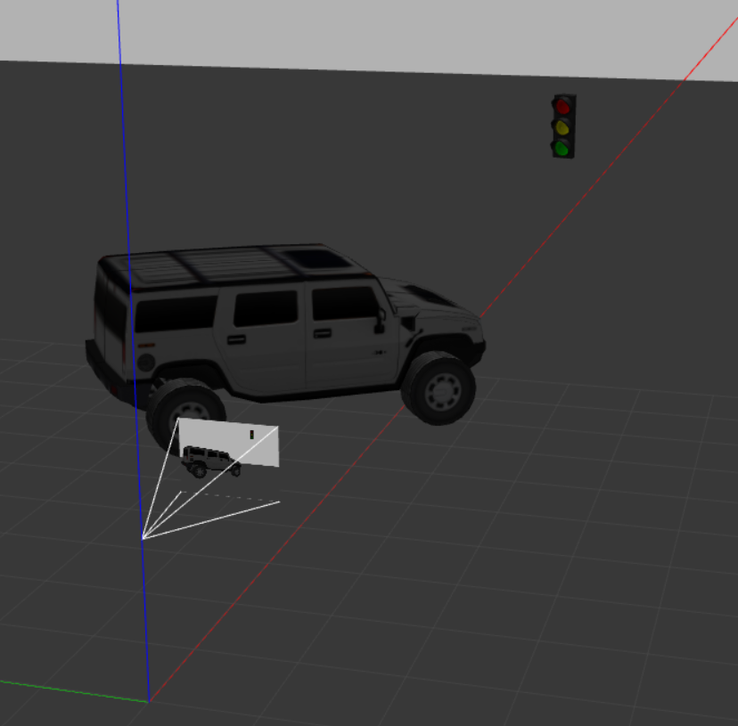

# Proof of concept of a YOLO Node annotating images from the Gazebo camera plugin in ROS2

A fixed Gazebo world containing a truck and a traffic light publishes `/camera/image_raw`.
A YOLOv8 node performs detection on CPU and publishes an annotated image for RViz.

## Quickstart
```bash
colcon build && source install/setup.bash
ros2 launch yolo_poc yolo_with_gazebo.launch.py
# camera topic: /camera/image_raw
# rviz config:   loaded automatically from the package
```

### Experiment-Setup and Data-Pipeline
The pipeline is: **Gazebo camera → ROS Image → YOLOv8 detections → annotated image → RViz**.

The proof-of-concept world contains a SUV (“truck” in the annotated image) and a traffic light. A camera sensor looks at the scene from z = 2m as in [fig1] and streams images at 15 FPS to `/camera/image_raw`. Those frames are consumed by the YOLO node, which emits `vision_msgs/Detection2DArray` with the Bounding box and an annotated image topic that RViz displays.

<a id="fig1"></a>
[](docs/poc-setup_in-gazebo-with-yolo_truck-setup.png)
**figure 1: The setup in the Gazebo world consists of a SUV from the gazebo libray, as well as trafficlight and a camera that is positioned at a heigt of 2 meter, facing in the direction of x =  1.**

## About the inner workings of the "Yolo-node"

The `yolo_node` subscribes to `/camera/image_raw` using a SENSOR_DATA QoS profile, converts frames to OpenCV via `cv_bridge`, and runs a lightweight YOLOv8 model from Ultralytics on the CPU. For each frame it converts detector outputs of the `xyxy` corners into ROS `vision_msgs/Detection2DArray`. The width/height is computed with (`w = x2 - x1`, `h = y2 - y1`) and the box center with (`cx = x1 + w/2`, `cy = y1 + h/2`). Following a  `BoundingBox2D` is populated with an `ObjectHypothesisWithPose`. This is shown as class label and confidence in a float value. The node publishes detections on `detections` and an annotated image on `yolo/annotated`.

An **OpenCV overlay** draws the Bounding boxes directly on the original frame with `cv2.rectangle` and labels with `cv2.putText`, then republished as a ROS `sensor_msgs/Image` and thus preserving the original header/stamp for downstream a sync.

Especially tricky is the setting of the  **`BoundingBox2D.center`**. Different message bindings can behave inconsistently when setting `bbox.center`. To be robust, the node detects at runtime whether it can (a) mutate fields (`bbox.center.x/y/theta = …`) or (b) assign a whole `Pose2D` (`bbox.center = Pose2D(...)`). If neither is supported, it falls back to publishing size-only boxes (so at least width/height are valid). This defensive approach avoids crashes while keeping detections useful.

### Visualization of the yolo node's output 
RViz subscribes to the annotated image (produced by the annotator/YOLO node). You can see bounding boxes and labels: e.g., truck and traffic light with confidence overlaid on the frame as in [fig2]. 

<a id="fig2"></a>
[](docs/yolo-annotated-image_in_rviz.png)
**figure 2: Display of the yolo annotations and boundingboxes returned via function callback within ROS2, in rviz2.**

### Fixed camera position in the Gazebo World
For reproducibility, the camera pose is fixed in the world, aimed at both objects so the model has clear features to detect as in figures [fig1-3]. This perspective ensures deterministic screenshots and testability.

<a id="fig3"></a>
[](docs/camera-perspective-in-gazebo-with-yolo_truck-setup.png)
**figure 3: Camera perspective in Gazebo shows the gazebo world in the background and the cameras image of it as smaller image in the lense in the foreground.**

## Topics
- **Input:** `/camera/image_raw` (`sensor_msgs/Image`)
- **Detections:** `/detections` (`vision_msgs/Detection2DArray`)
- **Annotated image (optional):** `/camera/image_annotated` (`sensor_msgs/Image`)

## Parameters (YOLO node)
- `input_image_topic` (default `/camera/image_raw`)
- `model` (e.g., `yolov8n.pt`)
- `device` (`cpu`)
- `conf_thres` (default `0.25`)
- `publish_annotated` (`true`/`false`)

## Testing
```bash
colcon test --packages-select yolo_poc
colcon test-result --verbose
```


