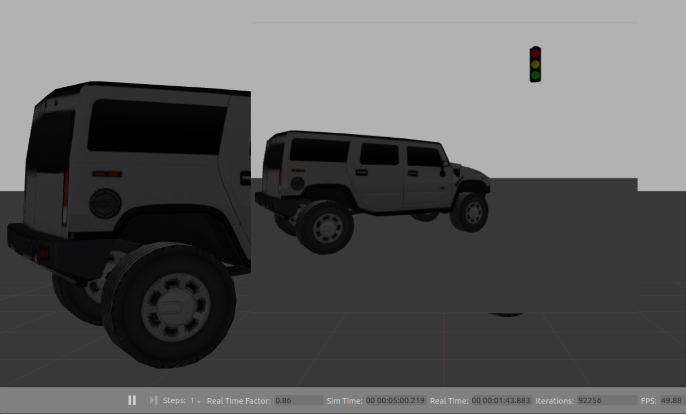

# Proof of concept of a YOLO Node annotating images from the Gazebo camera plugin in ROS2

A fixed Gazebo world containing a truck and a traffic light publishes `/camera/image_raw`.
A YOLOv8 node performs detection on the CPU and publishes an annotated image for RViz.

## Quickstart
```bash
$ colcon build && source install/setup.bash
$ ros2 launch yolo_poc yolo_with_gazebo.launch.py
```

### Experiment-Setup and Data-Pipeline
The pipeline is: **Gazebo camera → ROS image → YOLOv8 detections → annotated image → RViz**.

The proof-of-concept world contains an SUV-truck in the annotated image and a traffic light. A camera sensor looks at the scene from z = 2m as in [Figure_01](#Figure_01) and streams images at 15 FPS to `/camera/image_raw`. Those frames are consumed by the YOLO node, which emits `vision_msgs/Detection2DArray` with the Bounding box and an annotated image topic that RViz displays.


<div id="Figure_01" align="center">
  
  <br>
  <em><strong>Figure 1: </strong> The setup in the Gazebo world consists of a SUV from the gazebo library, as well as a traffic light and a camera that is positioned at a height of 2 meters, facing in the direction of x.</em>
</div>

### About the inner workings of the "Yolo-node"

The yolo_node subscribes to `/camera/image_raw` with a SENSOR_DATA QoS (KEEP_LAST, depth=5, BEST_EFFORT, VOLATILE), converts frames to OpenCV via cv_bridge, and runs a lightweight YOLOv8 model on the CPU. For each detection with `xyxy` corners it computes `w = x2 - x1, h = y2 - y1, cx = x1 + w/2, cy = y1 + h/2`, then builds a `vision_msgs/Detection2D`: bbox is a BoundingBox2D (center: Pose2D, size_x, size_y), and class plus confidence are added to `Detection2D.results` as an ObjectHypothesisWithPose. The node publishes a Detection2DArray on detections and an annotated image on `yolo/annotated`.

An OpenCV overlay draws rectangles and labels on the incoming frame with `cv2.rectangle and cv2.putText`, then republishes the result as `sensor_msgs/Image`. At startup the node probes how to set BoundingBox2D.center: first by mutating center.x/y/theta, otherwise by assigning a full Pose2D. If both attempts fail it still publishes detections with `size_x/size_y` set and a default (0, 0, 0) center. The on-frame overlay remains correct, but subscribers that rely on `bbox.center` should account for this fallback.

RViz subscribes to the annotated image produced by the node. Truck and traffic light are visualised with bounding boxes and confidences as in [Figure_02](#Figure_02).

<a id="Figure_02"></a>

<p align = "center">
  
  <em><strong>Figure 2:</strong> Display of the yolo annotations and bounding boxes returned via the function callback within ROS2, in RViz2.</em>
  <br>
</p>


### Fixed camera position in the Gazebo World

For reproducibility, the camera pose is fixed in the world, aimed at both objects, so the model has clear features for detection as in figures [Figure_03](#Figure_03).

<div id="Figure_03" align="center">
  
  <br>
  <em><strong>Figure 3:</strong> Camera perspective in Gazebo shows the Gazebo world in the background and the camera's image of it as a smaller image in the lens in the foreground.</em>
</div>

## ROS2-Topics
- **Input:** `/camera/image_raw` (`sensor_msgs/Image`)
- **Detections:** `/detections` (`vision_msgs/Detection2DArray`)
- **Annotated image (optional):** `/camera/image_annotated` (`sensor_msgs/Image`)

## YOLO node parameters
- `input_image_topic` (default `/camera/image_raw`)
- `model` (e.g., `yolov8n.pt`)
- `device` (`cpu`)
- `conf_thres` (default `0.25`)
- `publish_annotated` (`true`/`false`)

## Testing
```bash
colcon test --packages-select yolo_poc
colcon test-result --verbose
```


